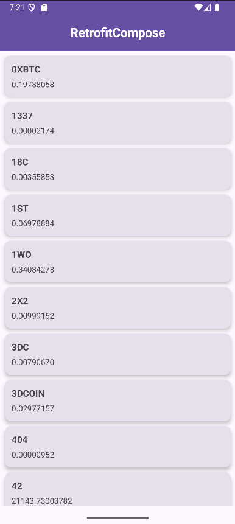

## 📱 RetrofitCompose

🚀 RetrofitCompose, Jetpack Compose ile modern Android UI tasarımını ve Retrofit kütüphanesi ile REST API’den veri çekmeyi bir araya getiren basit ama öğretici bir örnek projedir.

**Bu proje sayesinde:** 

Jetpack Compose kullanarak declarative UI geliştirmeyi,

Retrofit ile API çağrısı yapmayı,

JSON verilerini listelemeyi öğrendim.

## ✨ Özellikler

📡 Retrofit ile REST API’den veri çekme

🎨 Jetpack Compose ile modern UI tasarımı

🧩 Material 3 bileşenleri ile şık görünüm

📑 LazyColumn ile performanslı listeleme

💾 Örnek kripto para verilerini GitHub üzerinden JSON formatında kullanma

## 📷 Ekran Görüntüleri

## 🛠 Kullanılan Teknolojiler

-Kotlin

-Jetpack Compose

-Material 3

-Retrofit2

-Gson Converter

## 🚀 Nasıl Çalışır?

-Retrofit ile https://raw.githubusercontent.com/ tabanlı bir API endpoint’ine bağlanır.

-CryptoApi arayüzü üzerinden JSON verisi çekilir.

-Gelen veriler CryptoModel ile modellenir.

-Compose tarafında LazyColumn kullanılarak liste halinde gösterilir.

## 🎯 Amaç

Bu proje tamamen öğrenme odaklıdır. Retrofit ve Compose’u bir arada deneyimlemek isteyenler için basit bir örnek sunar.

## 🔮 Geliştirme Fikirleri

⏱ Veri yenileme butonu ekleme

🌙 Dark mode desteği

🔍 Arama / filtreleme özelliği

📊 Daha gerçekçi API entegrasyonu (ör. CoinGecko API)

